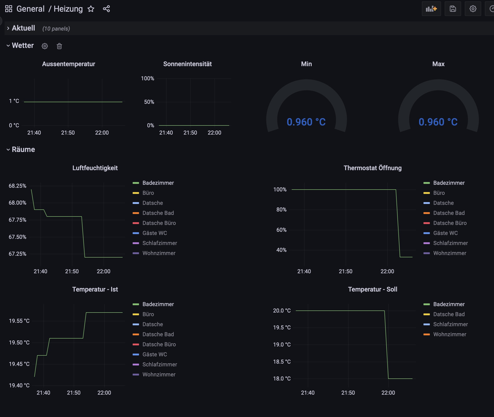

# Tado-Api-Proxy image
Provides a proxy to fetch Tado API data as container image.

### More informations about the TADO API
Please read this amazing documentation to find further details about the Tado api.

https://shkspr.mobi/blog/2019/02/tado-api-guide-updated-for-2019/
### How to start ?
Start your container binding your username and password.
```
docker run -d --name=tado-api-proxy -p 8080:8080 -e username=<your Tado mailadresse> -e password=<your Tado password> pbdger/tado-api-proxy
```
Try it out.

### How to get data ?

Request in a browser the URLs as shown.

```
http://localhost:8080/me
http://localhost:8080/home?homeId=<your homeId>
http://localhost:8080/weather?homeId=<your homeId>
http://localhost:8080/zones?homeId=<your homeId>
http://localhost:8080/zoneState?homeId=<your homeId>&zone=<one of your zone ids>
http://localhost:8080/zoneStateDateReport?homeId=<your homeId>&zone=<one of your zone ids>&date=<date in format yyyy-mm-dd>
```
#### your homeId
You find your homeId in the result of request http://localhost:8080/me

#### your zone ids
You find your zone ids in the result of request http://localhost:8080/zones?homeId=<your homeId>

### Additional optional environment parameters

```
debug: true | false, default is false
apiPort: number, default is 8080
clientSecret: string, default is wZaRN7rpjn3FoNyF5IFuxg9uMzYJcvOoQ8QWiIqS3hfk6gLhVlG57j5YNoZL2Rtc
```

## Grafana Integration
You find a Grafana dashboard example in the subfolder grafana.



This dashboard requires an InfluxDB. To fill a bucket in the InfluxDB you are free to
use Telegraf in combination with telegraf.conf example shown here in the subfolder telegraf.

## Docker image
You find an image here: https://hub.docker.com/repository/docker/pbdger/tado-api-proxy


## Core binary usage

#### Mandatory
Set the mandatory environment variable (This example is Linux based);

```
export wallboxPort=<IP or servername of your wallbox, e.g. 192.168.08.15>
```

#### Optional
Set the optional environment variables (This example is Linux based);

```
export wallboxPort=<Port on which your TCP/modbus listens. Default is 502>
```

#### Call on console
```
tado-api-proxy
```


### How to build your own version ?

```
GOOS=windows GOARCH=amd64 go build -o ./bin/tado-api-proxy.exe tado-api-proxy.go
GOOS=linux GOARCH=amd64 CGO_ENABLED=0 go build -o ./bin/tado-api-proxy.linux tado-api-proxy.go
```
